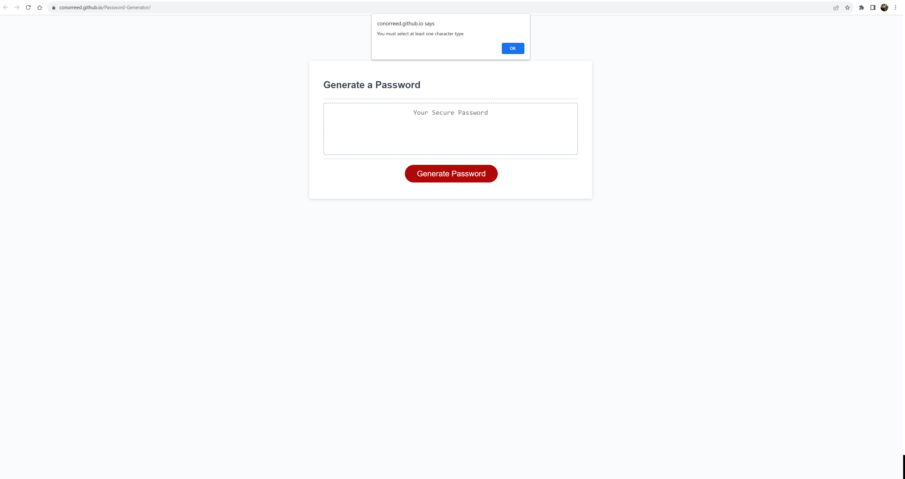

# Password Generator Starter Code
# <Password Generator>

## Description

This was a project that implemented javascript to add functionality to a password generator template. The javascript uses a prompt to ask the user what type of characters it would like to use for the password. There was data validation implemented that checked whether or not the password had made at least 1 decision about the characters chosen as well as chose a number between 8 and 128. The second aspect of javascript 

## Installation

https://conorreed.github.io/Password-Generator/

## Credits

There was a getRandomIntInclusive function that was copied from MDN that was used to get a random integer. Also, big credit to my dad who worked through this assignment with me and helped with the error validation and the while loop. 

## License

Look at license section

---
